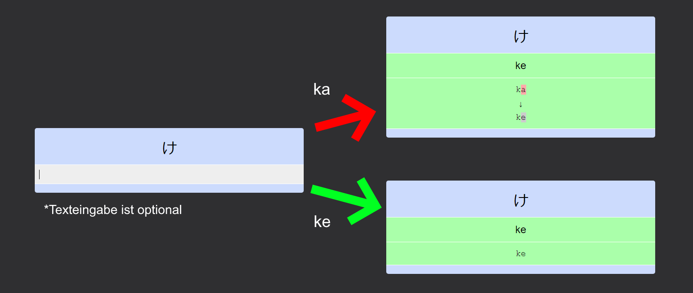

# Einführung in das Japanische

"Einführung in das Japanische" ist ein Japanischkurs der Universität Wien.
Der Kurs umfasst vier Lehrveranstalltungen (Einfürhung in das Japanische 1-4), die über einen Zeitraum von einem Jahr abgehalten werden.
Ingesamt entspricht der Kurs einen Arbeitsaufwand von 15 ECTS.
Der Vorlesung findet wöchentlich zweimal jeweils für 1,5 Stunden statt.

Externe Studierende von anderen Universitäten haben die Möglichkeit, diesen Kurs als Freifach mitzubelegen.
Hierfür muss **jedes Semester** ein [Antrag auf Mitbelegung](https://studieren.univie.ac.at/zulassung/mitbelegung/) gestellt werden.

## Beschreibung der Lehrveranstalltung

> Diese Lehrveranstaltung bezweckt, Studierenden, die weder Japanologie noch Übersetzen Japanisch studieren,
> Gelegenheit zu geben, Japanisch so weit zu erlernen, dass es ihnen möglich ist, japanische Texte für ihr
> Studium bzw. in ihrem Berufsleben zu lesen und sich auch mündlich in japanischer Sprache zu verständigen.
> Der Unterricht umfasst eine ausführliche Erklärung der Grammatik des Japanischen sowie Konversations- und
> Übersetzungsübungen anhand des Lehrbuches 90 Days of Japanese Language, UNICOM.
>
> -- <cite>https://ufind.univie.ac.at/de/course.html?lv=150003&semester=2022W</cite>

## Links zu den einzelnen Lehrveranstalltungen

1. [Einführung in das Japanische 1](https://ufind.univie.ac.at/de/course.html?lv=150003&semester=2023W) (3 ECTS)
2. [Einführung in das Japanische 2](https://ufind.univie.ac.at/de/course.html?lv=150015&semester=2023W) (4 ECTS)
3. [Einführung in das Japanische 3](https://ufind.univie.ac.at/de/course.html?lv=150014&semester=2023S) (4 ECTS)
4. [Einführung in das Japanische 4](https://ufind.univie.ac.at/de/course.html?lv=150013&semester=2023S) (4 ECTS)

## Anki Decks

Die Anki Decks können über Mega heruntergeladen werden.

[**Download HERE**](https://mega.nz/folder/4TUGXAQL#6xC7CGY_HOtRnpMXTbcnxA)

### Hiragana & Katakana

Das *Hiragana & Katakana*-Deck enthält die Lesung der beiden Silbenschriften der japanischen Sprache.
Allerdings sollte man nicht vergessen, das Schreiben auf Papier zu üben, da dies für die Prüfung verlangt wird.

* Karten: 214

### にんご90日

Das **にほんご90日**-Deck enthällt alle Inhalte des gleichnamigen Buches.
Dieses Deck enhält zusätzlich noch Lektionen 31 - 46 aus den Buch **にほんご90日 2**.
Um mit diesen Deck zu lernen, kann man ein [IME installieren](https://www.google.co.jp/ime/) oder die Japanische Sprache als Tastatursprache hinzufügen.

* Gesamt Karten: 2075
* davon Grammatik: 566
* davon Übersetzungübungen: 464
* davon Vokabel: 1045

### Einführung in das Japanische Kanji

Das *Einführung in das Japanische Kanji*-Deck enhält alle Kanji, die ab *Einführung in das Japanische 2* gekonnt werden müssen.
Für jedes Kanji muss eine *Kunyomi*- und eine *Onyomi*-Lesung sowie deren Bedeutung erlernt werden, sofern vorhanden).

* Einführung in das Japanische 1 - Keine Kanji müssen gelernt werden.
* Einführung in das Japanische 2 - Kanji 30 時 JI toki Zeit (Seite 2).
* Einführung in das Japanische 3 - Kanji 133 方 HOU kata Richtung (Seite 7).
* Einführung in das Japanische 4 - Kanji 328 打 DA utsu schlagen (Seite 15).

Inhalt:
* Karten: 976

